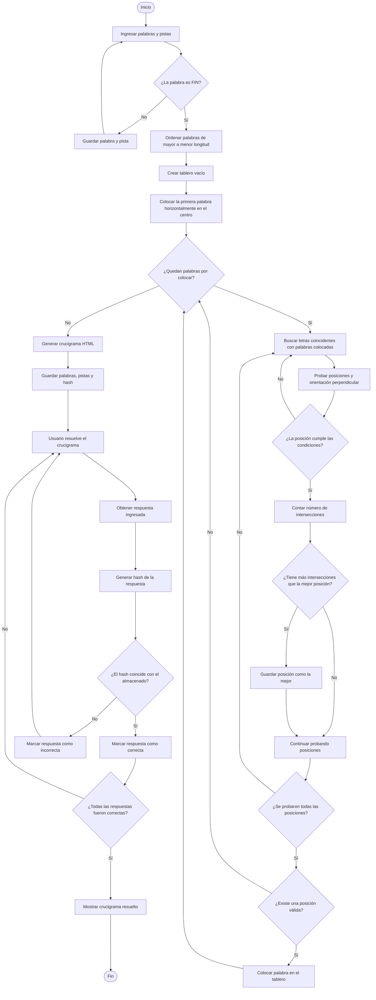

## 1. Nombre de la aplicación

**CrucigramaGreedy**

## 2. Requerimientos para ejecutarlo

La aplicación está desarrollada en **Python 3** y utiliza las siguientes librerías y herramientas:

* **Python 3:** lenguaje utilizado para desarrollar la aplicación.
  
* **Pillow (PIL):** librería utilizada para generar la imagen con la solución del crucigrama.
  
* **JSON:** módulo incluido en Python para trabajar con datos en formato JSON.
  
* **Navegador web:** se necesita Google Chrome, Microsoft Edge, Mozilla Firefox o cualquier navegador moderno para abrir el archivo HTML generado.
  
* **Sistema operativo:** Windows, Linux o macOS.
  
* **Instalación de Pillow:** ejecutar el siguiente comando en la terminal:

```bash
pip install Pillow
```
## 3. Algoritmo

## 1. El algoritmo de la aplicación funciona creando un crucigrama de manera automática a partir de las palabras y pistas que proporciona el usuario.

```python
lista_palabras = []

while True:
    numero_actual = len(lista_palabras) + 1
    palabra_ingresada = input(f"Palabra #{numero_actual}: ").strip()
    if palabra_ingresada.upper() == "FIN":
        break
    
    if not palabra_ingresada:
        print("No puedes dejar la palabra vacía.\n")
        continue

    pista_ingresada = input(f"Descripción para '{palabra_ingresada}': ").strip()
    lista_palabras.append([palabra_ingresada, pista_ingresada])
```

## 2. Primero, el programa guarda las palabras y las ordena de mayor a menor según su longitud.

```python
lista_palabras.append([palabra_ingresada, pista_ingresada])
```

```python
for i in range(total_ingresadas):
    for j in range(0, total_ingresadas - i - 1):
        if len(lista_palabras[j][0]) < len(lista_palabras[j + 1][0]):
            temp = lista_palabras[j]
            lista_palabras[j] = lista_palabras[j + 1]
            lista_palabras[j + 1] = temp
```

## 3. Después, crea un tablero vacío y coloca la primera palabra de forma horizontal en el centro.

```python
self.tablero = []
for i in range(filas):
    fila = []
    for j in range(columnas):
        fila.append('')
    self.tablero.append(fila)

self.palabras_colocadas = []
```

```python
if len(self.palabras_colocadas) == 0:
    f_centro = self.filas // 2
    c_centro = (self.columnas - len(palabra)) // 2
    c_centro = max(0, c_centro)
    if self.puede_colocar(palabra, f_centro, c_centro, 'H'):
        self.escribir_palabra(palabra, pista, f_centro, c_centro, 'H')
        return True
    return False
```

## 4. Para colocar las siguientes palabras, el algoritmo busca letras que coincidan con las palabras que ya están en el tablero y prueba diferentes posiciones para cruzarlas.

```python
for elem in self.palabras_colocadas:
    p_exist = elem['palabra']
    d_exist = elem['direccion']
    f_exist = elem['fila']
    c_exist = elem['columna']

    for i in range(len(palabra)):
        l1 = palabra[i]
        for j in range(len(p_exist)):
            l2 = p_exist[j]
            
            if l1 == l2:
                if d_exist == 'H':
                    nueva_dir = 'V'
                    r_test = f_exist - i
                    c_test = c_exist + j
                else:
                    nueva_dir = 'H'
                    r_test = f_exist + j
                    c_test = c_exist - i
```

## 5. Antes de colocar una palabra, verifica que no se salga del tablero, que las letras que coinciden sean iguales y que no quede pegada incorrectamente a otras palabras.

```python
largo = len(palabra)

if direccion == 'V':
    paso_fila = 1
    paso_col = 0
else:
    paso_fila = 0
    paso_col = 1

limite_fila = fila + (paso_fila * (largo - 1))
limite_col = columna + (paso_col * (largo - 1))

if limite_fila >= self.filas or limite_col >= self.columnas:
    return False
if fila < 0 or columna < 0:
    return False
```

```python
if celda != '':
    if celda != palabra[i]:
        return False
    intersecciones += 1
```

```python
if direccion == 'H':
    paso_lat_r = 1
    paso_lat_c = 0
else:
    paso_lat_r = 0
    paso_lat_c = 1

for lado in [-1, 1]:
    adj_r = r + (paso_lat_r * lado)
    adj_c = c + (paso_lat_c * lado)
    if 0 <= adj_r < self.filas and 0 <= adj_c < self.columnas:
        if self.tablero[adj_r][adj_c] != '':
            return False
```

## 6. Cuando encuentra varias posiciones posibles, selecciona la que tenga el mayor número de intersecciones, por lo que utiliza un algoritmo voraz (Greedy).

```python
mejor_f = None
mejor_c = None
mejor_dir = None
max_inter = -1
```

```python
if self.puede_colocar(palabra, r_test, c_test, nueva_dir):
    cant_inter = self.contar_intersecciones(
        palabra,
        r_test,
        c_test,
        nueva_dir
    )

    if cant_inter > max_inter:
        max_inter = cant_inter
        mejor_f = r_test
        mejor_c = c_test
        mejor_dir = nueva_dir
```

```python
if mejor_f is not None:
    self.escribir_palabra(
        palabra,
        pista,
        mejor_f,
        mejor_c,
        mejor_dir
    )
    return True
```

## 7. Finalmente, las palabras se guardan en el tablero y el programa genera una página HTML interactiva donde el usuario puede resolver el crucigrama y verificar sus respuestas mediante una función de hash.

```python
for i in range(len(palabra)):
    r = fila + (i * pf)
    c = columna + (i * pc)
    self.tablero[r][c] = palabra[i]
```

```python
datos_palabra = {
    'palabra': palabra,
    'pista': pista,
    'fila': fila,
    'columna': columna,
    'direccion': direccion,
    'hash': calcular_hash_palabra(palabra)
}
self.palabras_colocadas.append(datos_palabra)
```

```python
crucigrama.generar_html("crucigrama.html", titulo=titulo_ingresado)
```

```python
def calcular_hash_palabra(palabra):
    palabra = palabra.upper()
    x = (ord(palabra[0]) * 719) % 1138
    hash_val = 837

    for i in range(1, len(palabra) + 1):
        char_code = ord(palabra[i - 1])
        hash_val = (hash_val * i + 5 + (char_code - 64) * x) % 98503
        
    return hash_val
```

```javascript
if (HashWord(UserEntry) != AnswerHash[i] && UserEntry.length > 0) {
    ErrorsFound++;
    ChangeWordStyle(i, "ecw-box ecw-boxerror_unsel");
}
```

```javascript
function HashWord(Word) {
    var x = (Word.charCodeAt(0) * 719) % 1138;
    var Hash = 837;
    for (var i = 1; i <= Word.length; i++) {
        Hash = (Hash * i + 5 + (Word.charCodeAt(i - 1) - 64) * x) % 98503;
    }
    return Hash;
}
```


